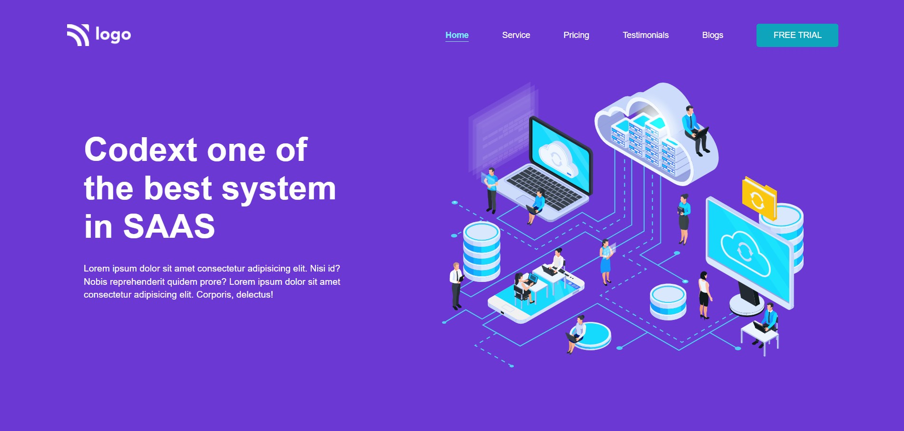

# Project 13 - HTML  and CSS 

By Pooja

Here's the Live Deployed Website 

## [DEPLOYED WEBSITE LINK](https://best-system-in-saas.netlify.app/)

## What I learned from this Project?

- I learned about **layout** making through **Flexbox & Grid**.
- I also learned how to make a full fledged website end to end.
- I also learned about making beautiful **Cards**.
- I also about adding svg images in this project.
- I also learned about customizing svg fill color.

## This project took around **4 hours** to complete.
